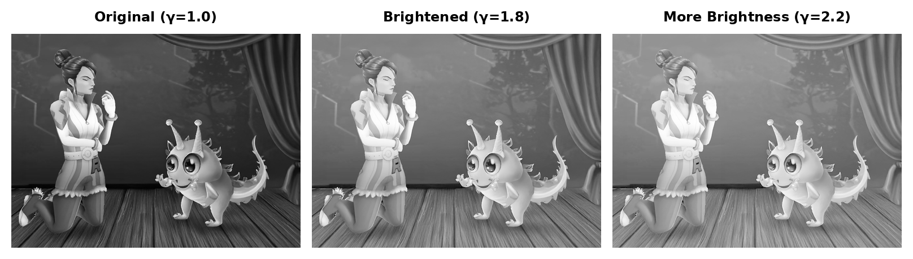

# Gamma Correction for E-Paper Displays

## Overview

Gamma correction has been added to improve image brightness on e-paper displays. This feature lightens the midtones of images while preserving the full dynamic range (black to white), making images appear clearer on e-paper.

## What is Gamma Correction?

Gamma correction adjusts the brightness of midtones in an image:
- **γ = 1.0**: No change (default)
- **γ > 1.0**: Brightens midtones (recommended for e-paper: 1.5-2.2)
- **γ < 1.0**: Darkens midtones

The correction preserves pure black (0) and pure white (255) while adjusting the middle gray values.

## Usage Examples

### Command Line (simple_update.py)

```bash
# Brighten an image with gamma=1.8
python -m update_waveshare.simple_update image.png --gamma 1.8 --virtual

# More aggressive brightening with gamma=2.2
python -m update_waveshare.simple_update image.png --gamma 2.2

# Use with other options
python -m update_waveshare.simple_update image.png --gamma 2.0 --dither --mode full
```

### Python API (update_waveshare)

```python
from update_waveshare.core import display_image

# Display image with gamma correction
display_image('photo.png', gamma=1.8, virtual=True)

# Use with other parameters
display_image('photo.png', gamma=2.0, dither=True, mode='full')
```

### Python API (picker.drivers.epaper_standalone)

```python
from picker.drivers.epaper_standalone import create_display

# Create display with gamma correction
display = create_display(gamma=1.8, force_simulation=True)

# Display an image (gamma is applied automatically)
display.display_image('photo.png', mode='auto')
```

## Recommended Gamma Values

- **1.0** - No correction (original image)
- **1.5** - Slight brightening, good for slightly dark images
- **1.8** - Moderate brightening, recommended starting point
- **2.0** - More brightening, good for darker images
- **2.2** - Standard sRGB gamma, significant brightening
- **2.5+** - Very bright, may lose shadow detail

## Visual Demonstration

The image below shows the same photo with different gamma values:



From left to right: Original (γ=1.0), Brightened (γ=1.8), More Brightness (γ=2.2)

## Technical Details

- Gamma correction is applied **after** grayscale conversion but **before** quantization
- Uses numpy for efficient pixel-level operations
- Formula: `output = input^(1/gamma)` where input is normalized to 0-1 range
- The correction is non-destructive and maintains image quality

## When to Use Gamma Correction

Use gamma correction when:
- Images appear too dark on the e-paper display
- Midtones need to be lighter for better visibility
- You want to preserve detail while increasing brightness
- You need consistent brightness across different images

## Installation Note

Gamma correction requires numpy. Install dependencies:

```bash
pip install -r update_waveshare/requirements.txt
# or
pip install -r picker/requirements.txt
```
